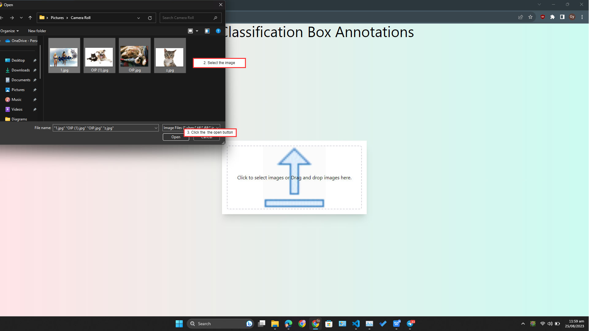
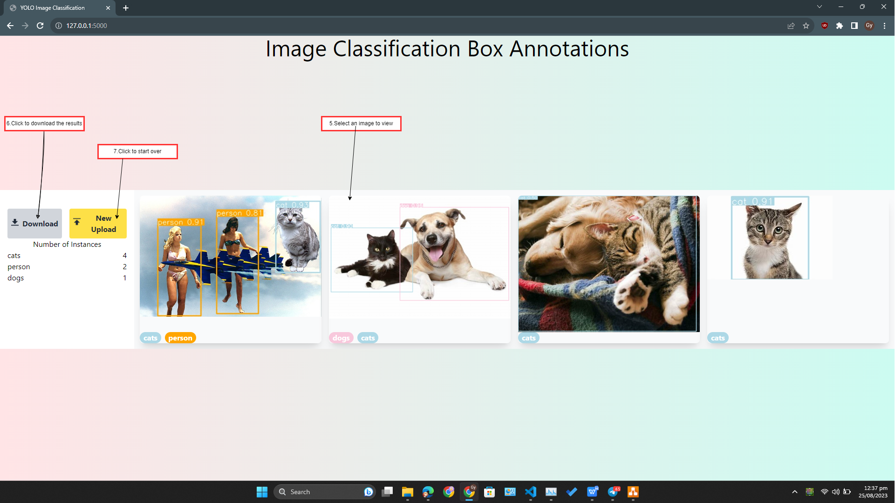

# Object Detection Annotation Tool

Welcome to the Object Detection Annotation Tool! This tool is designed to simplify the process of annotating images for object detection tasks using the YOLOv8 model.

## Table of Contents

- [Object Detection Annotation Tool](#object-detection-annotation-tool)
  - [Table of Contents](#table-of-contents)
  - [Introduction](#introduction)
  - [Features](#features)
  - [Getting Started](#getting-started)
  - [Model Used](#model-used)
  - [Custom Classes](#custom-classes)
  - [Technologies Used](#technologies-used)
  - [Usage](#usage)
  - [Navigation](#navigation)
    - [Images](#images)

## Introduction

Creating annotated datasets for custom object classification is a time-consuming and challenging task. This tool aims to automate and simplify the annotation process using the powerful YOLOv8 model. It provides a user-friendly web interface that allows users to upload images, automatically detect custom object classes, and obtain labels and annotations.

## Features

- Drag-and-drop or select image upload
- Click to upload
- Real-time object detection using YOLOv8
- Display of detected objects and their labels
- Download annotations in JSON format
- Preview and download of annotated images

## Getting Started

1. Install the required dependencies using `pip install -r requirements.txt`.
2. Run the application using `python app.py`.

## Model Used

The project utilizes the YOLOv8 model from Ultralytics (version 8.0.0) for object detection. This model is known for its accuracy and real-time detection capabilities.

## Custom Classes

The YOLOv8 model is trained to detect the following custom object classes:

- Birds
- Cats
- Dogs
- Person

## Technologies Used

- Flask: Web application framework
- HTML, JavaScript, and Tailwind CSS: Frontend development
- Ultralytics YOLOv8: Object detection model
- Flask-Nav: Navigation extension for Flask

## Usage

1. Access the web interface at `http://localhost:5000` in your web browser.
2. Upload images using drag-and-drop or the file manager.
3. Click the "Upload and Classify" button to perform object detection.
4. View the detected objects and their labels on the results page.
5. Download annotations and annotated images.

## Navigation

The web application includes the following sections:

- **Home**: Landing page with project overview
- **Upload & Classify**: Allows users to upload images and perform automatic classification
- **View Results**: Displays annotated results and allows users to view images and annotations
- **Download**: Provides the option to download annotated results in txt format

### Images

